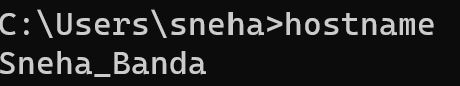
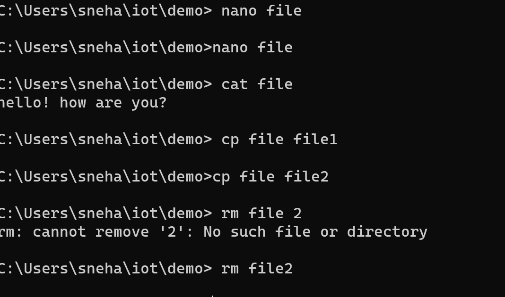

# $ hostname

# $ env
# $ ps
# $ pwd
# $ git clone https://github.com/kevinwlu/iot.git
# $ cd iot
# $ ls
# $ cd
# $ df
# $ mkdir demo
# $ cd demo
# $ nano file

# $ cat file

# $ cp file file1

# $ mv file file2

# $ rm file2

# $ clear

$ man uname

# $ uname -a

# $ ifconfig

# $ ping localhost

# $ netstat

